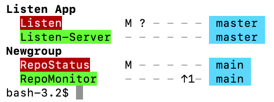

# RepoStatus

RepoStatus is a simple command line application for macOS to show a brief status of multiple Git repositories.

Repos can be collected into named groups, useful if you have projects with multiple repos.

Status shown includes:

	+ = Files added
	M = Files modified
	? = New untracked files
	S = Has stashed changes
	↑ = Ahead of remote
	↓ = Behind remote
	Current branch

Usage

    USAGE: RepoStatus <subcommand>

    OPTIONS:
      -h, --help              Show help information.

    SUBCOMMANDS:
      query (default)         Queries status of all configured Git repos.
      config                  Print config file path
      key                     Display description of status flags
      addgroup                Add a new group to the collection
      addrepo                 Add a repo to a group within the collection
      removegroup             Remove group, and all contained repos
      removerepo              Remove a repo

Screen shot:

